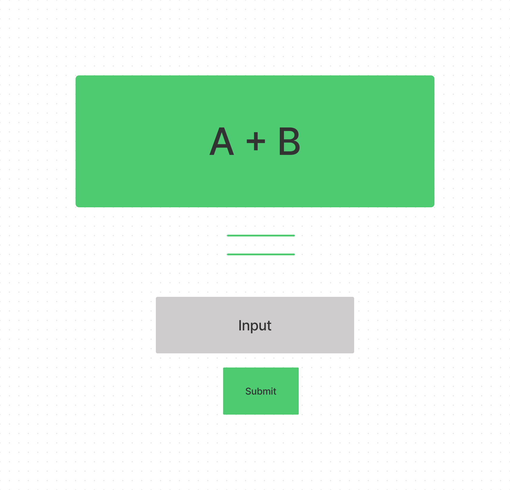
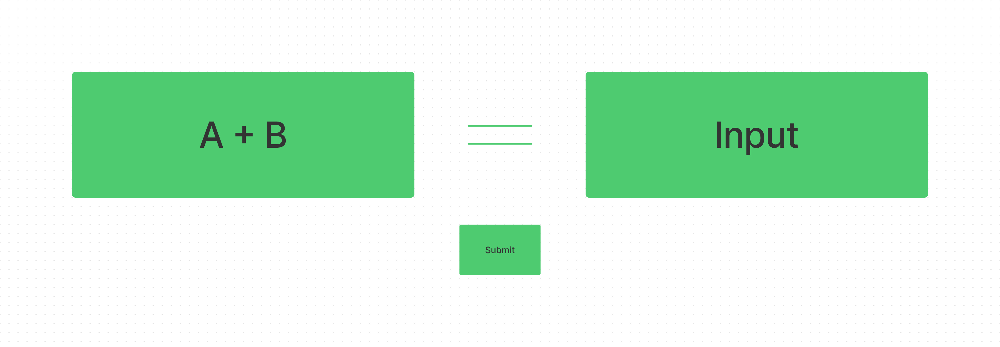

# Dictionary - PWA

A web dictionary using a dictionary API.

## Features

  * Search word
    - Definition
    - Synonyms
    - Pronunciation audio
  * Languages
    - Supports 12 languages
  * Progressive Web App
    - Can be downloaded as a progressive web app

### Live Demo

 A live demo can be found at [react-dictionary-ml.netlify.app](https://react-dictionary-ml.netlify.app/).

 

